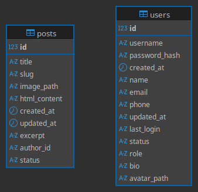

# Blog PME
Blog PME é um projeto monolítico de blog desenvolvido como parte de um desafio técnico para a vaga de Desenvolvedor Web Júnior. Ele permite que pequenas e médias empresas publiquem e gerenciem conteúdos de forma simples e eficiente.

## 📋 Descrição do Desafio
O projeto se baseia no seguinte enunciado:

Atividade 1: Criar um gerenciador de posts com login.

Atividade 2: Criar a área pública do blog, com:

Listagem de posts com campo de busca;

Página de detalhes para cada post.

## 🚀 Tecnologias Utilizadas
CodeIgniter 4 — Framework PHP

Eloquent ORM — ORM para modelagem de dados

Bootstrap 5 — Template frontend responsivo

jQuery — Manipulação de DOM e interações

MySQL 8 — Banco de dados relacional

Docker + Docker Compose — Ambiente de desenvolvimento isolado

PHPMyAdmin — Interface de gerenciamento do banco

Git para versionamento

## 📂 Estrutura do Projeto
```bash
.
├── app/                    # Diretório principal do CodeIgniter (MVC)
│   ├── Commands/           # Comandos personalizados do CLI (ex: criação de tabelas)
│   ├── Controllers/        # Lógica dos endpoints e rotas
│   ├── Models/             # Modelos Eloquent
│   ├── Views/              # Arquivos de interface (admin, auth, blog)
├── public/                 # Raiz pública do servidor (document root)
├── docker-compose.yml      # Arquivo de orquestração Docker
├── .docker/                # Configuração do Docker (Dockerfile, Apache)
├── .env                    # Configurações do ambiente
├── README.md               # Este arquivo
```
## ⚙️ Configuração do Ambiente
### Pré-requisitos
- Docker

- Docker Compose

## Instruções
Clone o repositório:

```bash
git clone https://github.com/seu-usuario/conecta-pme-blog.git
cd conecta-pme-blog
```
### Suba os containers:

```bash
docker-compose up -d
```
## Acesse a aplicação:

- Blog/Admin: http://localhost:8080

- PHPMyAdmin: http://localhost:8081

- Host: db

- Usuário: root

- Senha: root

### Crie as tabelas:

```bash
docker exec -it conecta-pme-blog-web-1 php spark db:createTables
```

## 👤 Área Administrativa
- Login protegido por autenticação

- Cadastro, edição e exclusão de posts

- Upload de imagem para o post

- Campo de descrição com suporte a HTML

## 📰 Área Pública do Blog
- Listagem de posts com campo de busca

- Visualização individual de cada post

- Slug amigável na URL

## 📸 Exemplo de Dados (Posts)
- title: Nome do post

- image_path: Caminho da imagem no diretório /public/uploads

- html_content: Corpo do post com HTML

## 📌 Observações
- Projeto monolítico: sem separação entre frontend e backend

- Ambiente preparado para desenvolvimento local com persistência de dados via volumes Docker

## 🗂️ Diagrama do Banco de Dados

